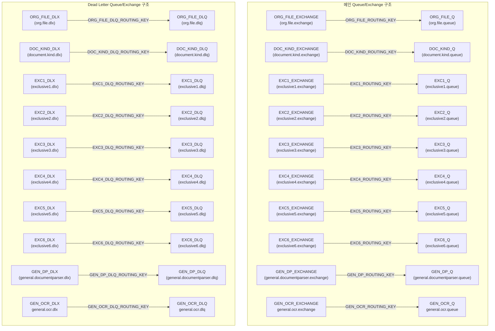

# RabbitMQ Queue/Exchange/DLQ 구조 정리

## 1. 메인 Queue/Exchange 구조

| Queue 명                                  | 용도                                   | 워커 수 | Binding Exchange                                    | Queue Routing Key                 |
| ----------------------------------------- | -------------------------------------- | ------- | --------------------------------------------------- | --------------------------------- |
| ORG_FILE_Q (`org.file.queue`)             | 원본파일\_Queue                        | 10      | ORG_FILE_EXCHANGE (`org.file.exchange`)             | ORG_FILE_ROUTING_KEY = ORG_FILE_Q |
| DOC_KIND_Q (`document.kind.queue`)        | 문서분류\_Queue                        | 5       | DOC_KIND_EXCHANGE (`document.kind.exchange`)        | DOC_KIND_ROUTING_KEY = DOC_KIND_Q |
| EXC1_Q (`exclusive1.queue`)               | 정보추출 모델\_진료비영수증\_Queue     | 5       | EXC1_EXCHANGE (`exclusive1.exchange`)               | EXC1_ROUTING_KEY = EXC1_Q         |
| EXC2_Q (`exclusive2.queue`)               | 정보추출 모델\_진료비세부내역서\_Queue | 5       | EXC2_EXCHANGE (`exclusive2.exchange`)               | EXC2_ROUTING_KEY = EXC2_Q         |
| EXC3_Q (`exclusive3.queue`)               | 정보추출 모델\_처방전\_Queue           | 5       | EXC3_EXCHANGE (`exclusive3.exchange`)               | EXC3_ROUTING_KEY = EXC3_Q         |
| EXC4_Q (`exclusive4.queue`)               | 정보추출 모델\_진단서소견서\_Queue     | 5       | EXC4_EXCHANGE (`exclusive4.exchange`)               | EXC4_ROUTING_KEY = EXC4_Q         |
| EXC5_Q (`exclusive5.queue`)               | 정보추출 모델\_수술기록지\_Queue       | 5       | EXC5_EXCHANGE (`exclusive5.exchange`)               | EXC5_ROUTING_KEY = EXC5_Q         |
| EXC6_Q (`exclusive6.queue`)               | 정보추출 모델\_검사결과지\_Queue       | 5       | EXC6_EXCHANGE (`exclusive6.exchange`)               | EXC6_ROUTING_KEY = EXC6_Q         |
| GEN_DP_Q (`general.documentparser.queue`) | 범용모델\_DocumentParser_Queue         | 5       | GEN_DP_EXCHANGE (`general.documentparser.exchange`) | GEN_DP_ROUTING_KEY = GEN_DP_Q     |
| GEN_OCR_Q (`general.ocr.queue`)           | 범용모델\_병용OCR_Queue                | 5       | GEN_OCR_EXCHANGE (`general.ocr.exchange`)           | GEN_OCR_ROUTING_KEY = GEN_OCR_Q   |

## 2. Dead Letter Queue(DLQ) 구조

| DLQ 명                                    | 용도                                 | 워커 수 | Binding DLX(Dead Letter Exchange)         | DLQ Routing Key                         |
| ----------------------------------------- | ------------------------------------ | ------- | ----------------------------------------- | --------------------------------------- |
| ORG_FILE_DLQ (`org.file.dlq`)             | 원본파일\_DLQ                        | 1       | ORG_FILE_DLX (`org.file.dlx`)             | ORG_FILE_DLQ_ROUTING_KEY = ORG_FILE_DLQ |
| DOC_KIND_DLQ (`document.kind.dlq`)        | 문서분류\_DLQ                        | 1       | DOC_KIND_DLX (`document.kind.dlx`)        | DOC_KIND_DLQ_ROUTING_KEY = DOC_KIND_DLQ |
| EXC1_DLQ (`exclusive1.dlq`)               | 정보추출 모델\_진료비영수증\_DLQ     | 1       | EXC1_DLX (`exclusive1.dlx`)               | EXC1_DLQ_ROUTING_KEY = EXC1_DLQ         |
| EXC2_DLQ (`exclusive2.dlq`)               | 정보추출 모델\_진료비세부내역서\_DLQ | 1       | EXC2_DLX (`exclusive2.dlx`)               | EXC2_DLQ_ROUTING_KEY = EXC2_DLQ         |
| EXC3_DLQ (`exclusive3.dlq`)               | 정보추출 모델\_처방전\_DLQ           | 1       | EXC3_DLX (`exclusive3.dlx`)               | EXC3_DLQ_ROUTING_KEY = EXC3_DLQ         |
| EXC4_DLQ (`exclusive4.dlq`)               | 정보추출 모델\_진단서소견서\_DLQ     | 1       | EXC4_DLX (`exclusive4.dlx`)               | EXC4_DLQ_ROUTING_KEY = EXC4_DLQ         |
| EXC5_DLQ (`exclusive5.dlq`)               | 정보추출 모델\_수술기록지\_DLQ       | 1       | EXC5_DLX (`exclusive5.dlx`)               | EXC5_DLQ_ROUTING_KEY = EXC5_DLQ         |
| EXC6_DLQ (`exclusive6.dlq`)               | 정보추출 모델\_검사결과지\_DLQ       | 1       | EXC6_DLX (`exclusive6.dlx`)               | EXC6_DLQ_ROUTING_KEY = EXC6_DLQ         |
| GEN_DP_DLQ (`general.documentparser.dlq`) | 범용모델\_DocumentParser_DLQ         | 1       | GEN_DP_DLX (`general.documentparser.dlx`) | GEN_DP_DLQ_ROUTING_KEY = GEN_DP_DLQ     |
| GEN_OCR_DLQ (`general.ocr.dlq`)           | 범용모델\_병용OCR_DLQ                | 1       | GEN_OCR_DLX (`general.ocr.dlx`)           | GEN_OCR_DLQ_ROUTING_KEY = GEN_OCR_DLQ   |

---

## 3. 전체 구조 도식화

아래는 위 구조를 시각화한 Mermaid 다이어그램입니다.



---

## 게이트웨이 상세 아키텍처 요약

### 1. **전체 흐름**

- **외부 시스템**(이미지 시스템, 기관계 등) → **게이트웨이**(API Controller, 문서 분류 Sender 등) → **Exchange** → **Queue** → **Worker** → **AI-OCR**
- **트랜잭션 관리**: 모든 트랜잭션 과정은 저장(요청 단위 기준), Queue에서 polling 방식으로 관리

---

### 2. **주요 컴포넌트별 역할**

#### **A. 게이트웨이 (Gateway)**

- **API Controller**: 외부에서 요청을 받아 Exchange로 메시지 Publish
- **문서 분류 Sender**: 문서 분류 결과를 Exchange로 Publish
- **트랜잭션 관리**: 모든 트랜잭션 과정을 저장, polling 방식으로 Queue 상태 관리

#### **B. Exchange**

- **Org.file.exchange**: 원본 파일용 Exchange
- **Document.kind.exchange**: 문서 분류용 Exchange
- **Exclusive1~3.exchange**: 정보추출 모델별 Exchange (진료비영수증, 진료비세부내역서, 처방전 등)
- 각 Exchange는 해당 Queue로 메시지를 라우팅

#### **C. Queue**

- **org.file.queue**: 원본 파일용 Queue
- **document.kind.queue**: 문서 분류용 Queue
- **exclusive1~3.queue**: 정보추출 모델별 Queue
- 각 Queue는 Dead Letter Exchange(DLX)와 연결되어 있음

#### **D. Dead Letter Exchange/Queue**

- 각 Queue는 DLX(DLX, Dead Letter Exchange)와 연결되어, 실패 메시지는 Dead Letter Queue로 이동

#### **E. Worker**

- 각 Queue별로 Worker가 존재
- **Consumer**: Queue에서 메시지 수신
- **Producer**: 처리 결과를 다음 단계(예: AI-OCR, DB 등)로 전송
- **AI-OCR**: 최종적으로 AI-OCR 엔진과 연동

---

### 3. **흐름 요약**

1. **외부 시스템**이 게이트웨이로 요청
2. **게이트웨이**가 Exchange에 메시지 Publish
3. **Exchange**가 적절한 **Queue**로 메시지 라우팅
4. **Worker**가 Queue에서 메시지 polling/consume
5. **Worker**가 처리 후 결과를 다음 단계로 전달 (필요시 Producer 역할)
6. 처리 실패 시 **Dead Letter Queue**로 이동
7. **트랜잭션 관리** 시스템이 전체 과정을 모니터링 및 저장

---

### 4. **구조적 특징**

- **Exchange-Queue-Worker** 구조가 명확하게 분리
- 각 단계별로 Dead Letter 처리(실패 메시지 관리)
- Worker는 Consumer+Producer 역할을 동시에 수행
- 트랜잭션 관리로 신뢰성 보장

---

### 5. **텍스트 기반 도식 예시**

```
[외부 시스템/기관계]
        │
        ▼
[게이트웨이]
  ├─ API Controller
  ├─ 문서 분류 Sender
  └─ 트랜잭션 관리
        │
        ▼
[Exchange] ──▶ [Queue] ──▶ [Worker] ──▶ [AI-OCR]
   │             │           │
   ▼             ▼           ▼
[Dead Letter Exchange] ──▶ [Dead Letter Queue]

```

---

필요하다면 이 구조를 Mermaid 등으로도 그려드릴 수 있습니다!  
추가로 궁금한 점이나, 더 세부적으로 보고 싶은 부분이 있으면 말씀해 주세요.

## 아키텍처 패턴: 전용 Exchange 1:1 바인딩

각 Queue마다 전용 Exchange를 두어 독립적인 메시징 경로를 구성하는 패턴

### 특징:

- ✅ 완전한 독립성
- ✅ 확장성 (새로운 타입 추가 시 기존 영향 없음)
- ✅ 장애 격리
- ✅ 명확한 모니터링

### 구조:

Exchange ←→ Queue (1:1 매핑)
